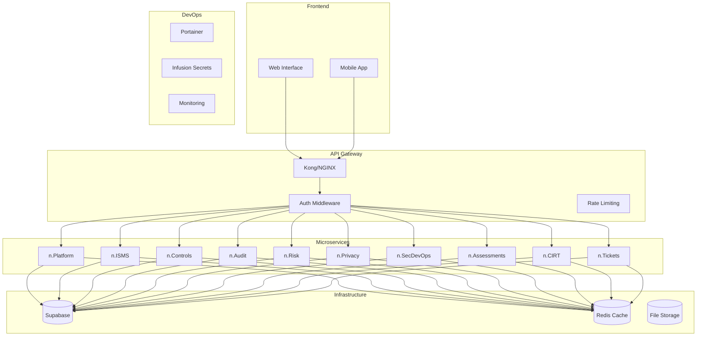

# 🏗️ Arquitetura - n.ciso Platform

## Visão Geral

A plataforma `n.ciso` é uma aplicação multi-tenant baseada em microserviços, projetada para gestão de segurança da informação com foco em conformidade, riscos e auditoria.

## 🏛️ Arquitetura de Alto Nível



## 🧩 Componentes Principais

### 1. Frontend
- **Tecnologia:** React/Next.js
- **Características:** 
  - Interface responsiva
  - PWA capabilities
  - Componentes reutilizáveis
  - Design system consistente

### 2. API Gateway
- **Tecnologia:** Kong ou NGINX
- **Funcionalidades:**
  - Roteamento de requisições
  - Rate limiting
  - Load balancing
  - SSL termination
  - Logging centralizado

### 3. Microserviços

#### n.Platform
- **Responsabilidade:** Autenticação, autorização, multi-tenancy
- **Tecnologia:** Node.js/Express ou Python/FastAPI
- **Integração:** Supabase Auth
- **APIs:**
  - `/platform/api/v1/users`
  - `/platform/api/v1/roles`
  - `/platform/api/v1/tenants`

#### n.ISMS
- **Responsabilidade:** Gestão do Sistema de Gestão de Segurança da Informação
- **Tecnologia:** Node.js/Express
- **APIs:**
  - `/isms/api/v1/policies`
  - `/isms/api/v1/controls`
  - `/isms/api/v1/compliance`
  - `/isms/api/v1/domains`
  - `/isms/api/v1/assessments`

#### n.Controls
- **Responsabilidade:** Catálogo de controles de segurança
- **Tecnologia:** Node.js/Express
- **APIs:**
  - `/controls/api/v1/frameworks`
  - `/controls/api/v1/domains`
  - `/controls/api/v1/controls`

#### n.Audit
- **Responsabilidade:** Gestão de auditorias
- **Tecnologia:** Node.js/Express
- **APIs:**
  - `/audit/api/v1/audits`
  - `/audit/api/v1/findings`
  - `/audit/api/v1/evidence`

#### n.Risk
- **Responsabilidade:** Gestão de riscos
- **Tecnologia:** Node.js/Express
- **APIs:**
  - `/risk/api/v1/risks`
  - `/risk/api/v1/assessments`
  - `/risk/api/v1/kris`

#### n.Privacy
- **Responsabilidade:** Conformidade LGPD/GDPR
- **Tecnologia:** Node.js/Express
- **APIs:**
  - `/privacy/api/v1/consents`
  - `/privacy/api/v1/data-subjects`
  - `/privacy/api/v1/processing-activities`

#### n.SecDevOps
- **Responsabilidade:** Testes de segurança
- **Tecnologia:** Python/FastAPI
- **APIs:**
  - `/secdevops/api/v1/projects`
  - `/secdevops/api/v1/scans`
  - `/secdevops/api/v1/reports`

#### n.Assessments
- **Responsabilidade:** Avaliações estruturadas
- **Tecnologia:** Node.js/Express
- **APIs:**
  - `/assessments/api/v1/templates`
  - `/assessments/api/v1/responses`
  - `/assessments/api/v1/reports`

#### n.CIRT
- **Responsabilidade:** Resposta a incidentes
- **Tecnologia:** Node.js/Express
- **APIs:**
  - `/cirt/api/v1/incidents`
  - `/cirt/api/v1/tasks`
  - `/cirt/api/v1/playbooks`

#### n.Tickets
- **Responsabilidade:** Sistema de suporte
- **Tecnologia:** Node.js/Express
- **APIs:**
  - `/tickets/api/v1/tickets`
  - `/tickets/api/v1/categories`
  - `/tickets/api/v1/slas`

## 🗄️ Banco de Dados

### Supabase (PostgreSQL)
- **Schema:** Multi-tenant com isolamento por tenant_id
- **Tabelas principais:**
  - `tenants` - Organizações
  - `users` - Usuários do sistema
  - `roles` - Perfis de acesso
  - `permissions` - Permissões granulares
  - `policies` - Políticas de segurança
  - `controls` - Controles de segurança
  - `risks` - Riscos identificados
  - `audits` - Auditorias
  - `incidents` - Incidentes de segurança

### Redis
- **Uso:** Cache de sessões, dados temporários
- **Tópicos:**
  - Rate limiting
  - Cache de consultas
  - Filas de processamento

## 🔐 Segurança

### Autenticação
- **Provedor:** Supabase Auth
- **Métodos:** Email/Senha, OAuth (Google, GitHub)
- **MFA:** Obrigatório para admin
- **Sessões:** JWT com refresh tokens

### Autorização
- **Modelo:** RBAC (Role-Based Access Control)
- **Granularidade:** Permissões por módulo e ação
- **Isolamento:** Multi-tenant com tenant_id

### Criptografia
- **Em trânsito:** TLS 1.3
- **Em repouso:** AES-256
- **Secrets:** Infusion para gestão segura

## 🚀 Deploy e Infraestrutura

### Containerização
- **Tecnologia:** Docker
- **Orquestração:** Docker Compose (dev) / Kubernetes (prod)
- **Gestão:** Portainer

### CI/CD
- **Pipeline:** GitHub Actions
- **Testes:** Unit, Integration, E2E
- **Deploy:** Blue/Green deployment
- **Rollback:** Automático em caso de falha

### Monitoramento
- **Logs:** ELK Stack (Elasticsearch, Logstash, Kibana)
- **Métricas:** Prometheus + Grafana
- **Alertas:** PagerDuty / Slack
- **Health Checks:** Endpoints de saúde por serviço

## 📊 Performance

### Otimizações
- **Cache:** Redis para consultas frequentes
- **CDN:** Para assets estáticos
- **Database:** Índices otimizados
- **API:** Paginação e filtros

### SLAs
- **Disponibilidade:** 99.9%
- **Latência:** < 200ms (p95)
- **Throughput:** 1000+ req/s

## 🔄 Integrações

### Ferramentas de Segurança
- **SAST:** SonarQube, CodeQL
- **DAST:** OWASP ZAP
- **IAST:** Contrast Security
- **Vulnerability Scanners:** Nessus, Qualys

### Ferramentas de DevOps
- **CI/CD:** GitHub Actions, GitLab CI
- **Container Registry:** Docker Hub, AWS ECR
- **Secrets Management:** Infusion
- **Monitoring:** DataDog, New Relic

## 🧪 Testes

### Estratégia
- **Unit Tests:** 90%+ coverage
- **Integration Tests:** APIs e banco de dados
- **E2E Tests:** Fluxos críticos
- **Security Tests:** SAST, DAST, penetration testing
- **Performance Tests:** Load testing, stress testing

## 📈 Escalabilidade

### Horizontal
- **Microserviços:** Escaláveis independentemente
- **Load Balancer:** Distribuição de carga
- **Database:** Read replicas, sharding

### Vertical
- **Recursos:** CPU, RAM escaláveis
- **Storage:** SSD com alta performance
- **Network:** Alta largura de banda

## 🔧 Configuração

### Environment Variables
```bash
# Database
DATABASE_URL=postgresql://...
SUPABASE_URL=https://...
SUPABASE_ANON_KEY=...

# Redis
REDIS_URL=redis://...

# Security
JWT_SECRET=...
ENCRYPTION_KEY=...

# External Services
INFUSION_API_KEY=...
```

### Configuração por Ambiente
- **Development:** Docker Compose
- **Staging:** Kubernetes (minimal)
- **Production:** Kubernetes (full HA) 