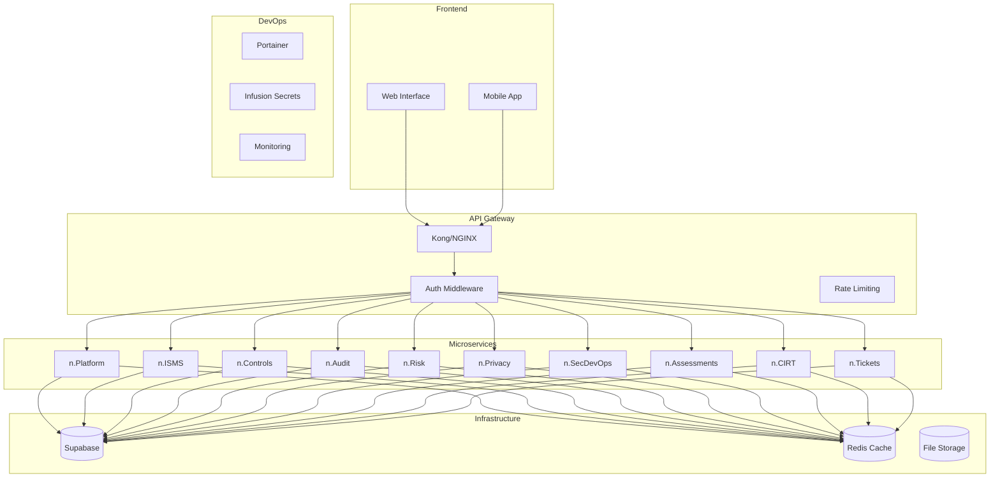

# 🏛️ Arquitetura de Alto Nível

```mermaid
graph TB
    subgraph "Frontend"
        UI[Web Interface]
        Mobile[Mobile App]
    end
    
    subgraph "API Gateway"
        Gateway[Kong/NGINX]
        Auth[Auth Middleware]
        RateLimit[Rate Limiting]
    end
    
    subgraph "Microservices"
        Platform[n.Platform]
        ISMS[n.ISMS]
        Controls[n.Controls]
        Audit[n.Audit]
        Risk[n.Risk]
        Privacy[n.Privacy]
        SecDevOps[n.SecDevOps]
        Assessments[n.Assessments]
        CIRT[n.CIRT]
        Tickets[n.Tickets]
    end
    
    subgraph "Infrastructure"
        Supabase[(Supabase)]
        Redis[(Redis Cache)]
        Storage[(File Storage)]
    end
    
    subgraph "DevOps"
        Portainer[Portainer]
        Infusion[Infusion Secrets]
        Monitoring[Monitoring]
    end
    
    UI --> Gateway
    Mobile --> Gateway
    Gateway --> Auth
    Auth --> Platform
    Auth --> ISMS
    Auth --> Controls
    Auth --> Audit
    Auth --> Risk
    Auth --> Privacy
    Auth --> SecDevOps
    Auth --> Assessments
    Auth --> CIRT
    Auth --> Tickets
    
    Platform --> Supabase
    ISMS --> Supabase
    Controls --> Supabase
    Audit --> Supabase
    Risk --> Supabase
    Privacy --> Supabase
    SecDevOps --> Supabase
    Assessments --> Supabase
    CIRT --> Supabase
    Tickets --> Supabase
    
    Platform --> Redis
    ISMS --> Redis
    Controls --> Redis
    Audit --> Redis
    Risk --> Redis
    Privacy --> Redis
    SecDevOps --> Redis
    Assessments --> Redis
    CIRT --> Redis
    Tickets --> Redis
```
